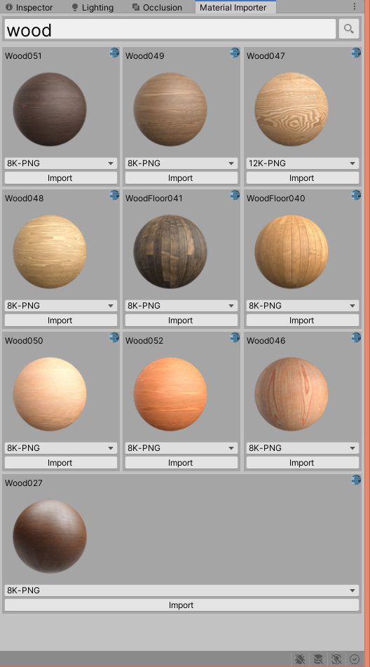

[](https://circleci.com/gh/oparaskos/unity-material-library)

# Hestia | Unity Material Library UI
material loader ui for Unity for online sources of materials

**Import materials within the editor from **
* [CC0Textures](https://cc0textures.com/)

**Generate Materials for lit shaders in HDRP, URP and Standard render pipelines.**




### Using Git

Make sure the Git client is installed on your marchine and that you have added the Git executable path to your `PATH` environment variable.

Navigate to `%ProjectFolder%/Packages/` and open the `manifest.json` file.

in the "dependencies" section add:

```json
{
  "dependencies": {
      ...
      "com.github.oparaskos.unity.hestia.material.importer": "git+https://github.com/oparaskos/unity-material-library.git#0.1.1",
      ...
  }
}
```

Find more information about this [here](https://docs.unity3d.com/Manual/upm-git.html).


## TODO:
- Imported materials still look a little bit funky.
- Package up into a unity package
- write some tests
- Support [additional](https://gist.github.com/mauricesvay/1330cc530f6ab2ef33eb6a5ea56ef5bd) sources.